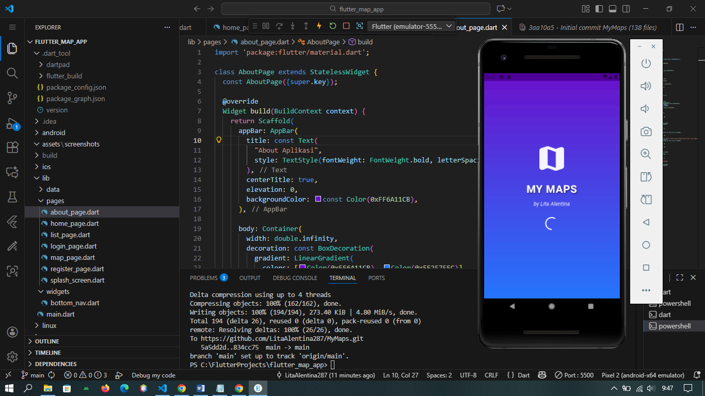
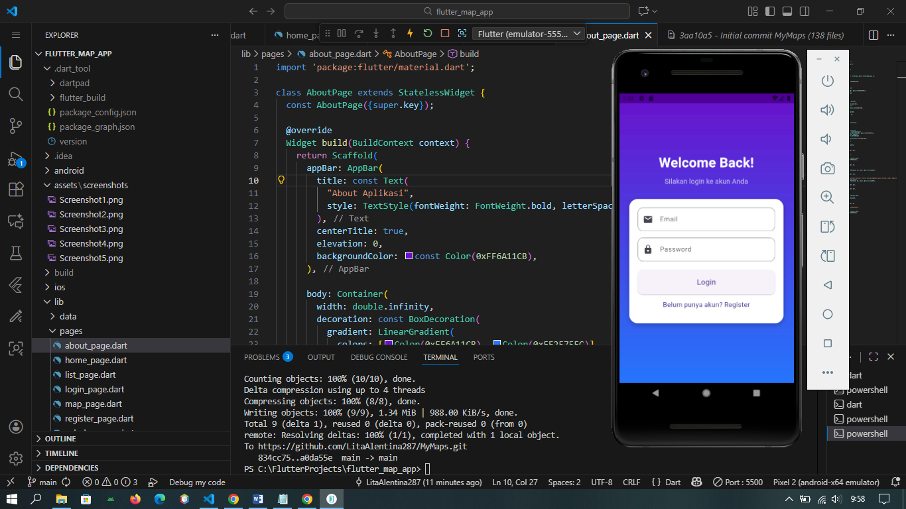
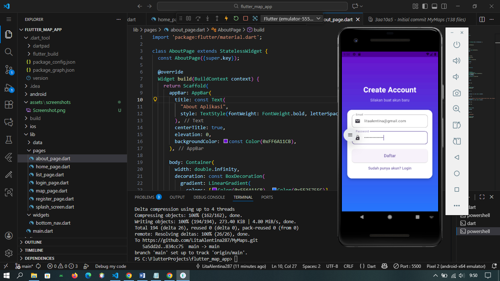
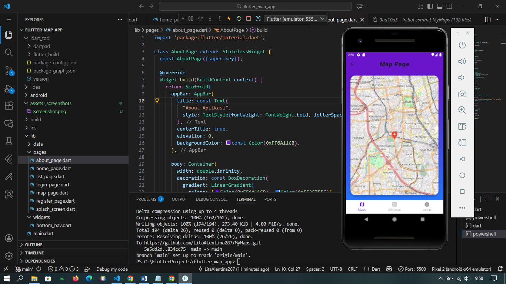
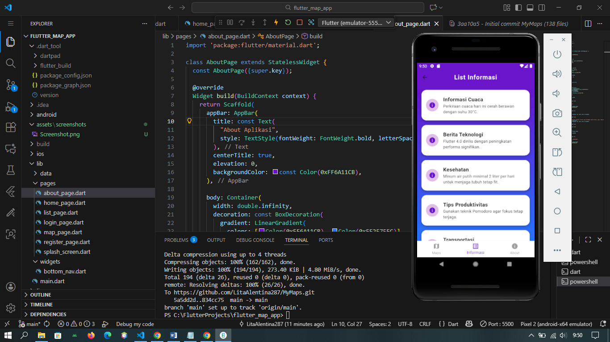
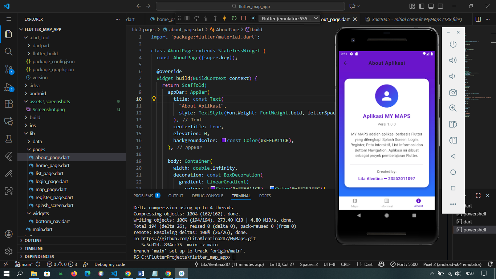

🌍 MyMaps — Flutter Map Application
==================================

MyMaps adalah aplikasi peta interaktif berbasis Flutter yang dibuat sebagai proyek pembelajaran.
Aplikasi ini memanfaatkan package flutter_map dengan data koordinat dari OpenStreetMap, 
dilengkapi fitur navigasi antar halaman, daftar informasi, serta halaman About.

Fitur Utama
--------------

- **Splash Screen**  
  Menampilkan logo aplikasi sebelum masuk ke halaman utama.

- **Halaman Login & Register**  
  Mendukung proses autentikasi sederhana.  
  - Login Page: untuk masuk ke aplikasi  
  - Register Page: untuk mendaftarkan akun baru  

- **Interactive Map (Flutter Map)**  
  Menampilkan peta menggunakan OpenStreetMap dengan marker pada koordinat tertentu.

- **List Informasi Penting**  
  Daftar item informasi yang dapat dilihat oleh pengguna.

- **About Page**  
  Menampilkan informasi aplikasi, versi, dan developer.

- **Bottom Navigation Bar**  
  Navigasi cepat antara halaman Map, List, dan About.

Teknologi yang Digunakan
---------------------------

- Flutter 3.x
- Dart
- flutter_map (OpenStreetMap)
- latlong2
- Material Design UI

Struktur Project
-------------------

FLUTTER_MAP_APP/
│
├── assets/
│   ├── screenshots/
│   │   ├── Screenshot1.png
│   │   ├── Screenshot2.png
│   │   ├── Screenshot3.png
│   │   ├── Screenshot4.png
│   │   ├── Screenshot5.png
│   │   └── Screenshot6.png
│
├── lib/
│   ├── data/
│   │   └── user_data.dart
│   │
│   ├── pages/
│   │   ├── about_page.dart
│   │   ├── home_page.dart
│   │   ├── list_page.dart
│   │   ├── login_page.dart
│   │   ├── map_page.dart
│   │   ├── register_page.dart
│   │   ├── splash_screen.dart
│   │
│   ├── widgets/
│   │   └── bottom_nav.dart
│   │
│   └── main.dart
│
├── android/
├── ios/
├── web/
├── linux/
├── macos/
├── windows/
│
├── pubspec.yaml
└── .gitignore

---

## 📸 Screenshots

| Splash Screen |
|--------------|
|  |

| Login Page |
|--------------|
|  |

| Register Page |
|--------------|
|  |

| Home Map |
|--------------|
|  |

| List Page |
|--------------|
|  |

| About Page |
|--------------|
|  |

Contoh:
- Splash Screen
- Halaman Login
- Halaman Map
- Halaman About

Cara Menjalankan Project
1. Clone Repository
   git clone https://github.com/LitaAlentina287/MyMaps.git

2. Masuk ke Folder Project
   cd MyMaps

3. Install Dependencies
   flutter pub get

4. Jalankan Aplikasi
   flutter run

Developer
Lita Alentina  
NIM: 23552011097  
Project tugas UTS mata kuliah Pemrograman Mobile 2

